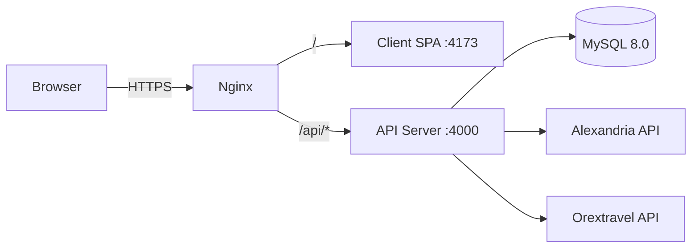
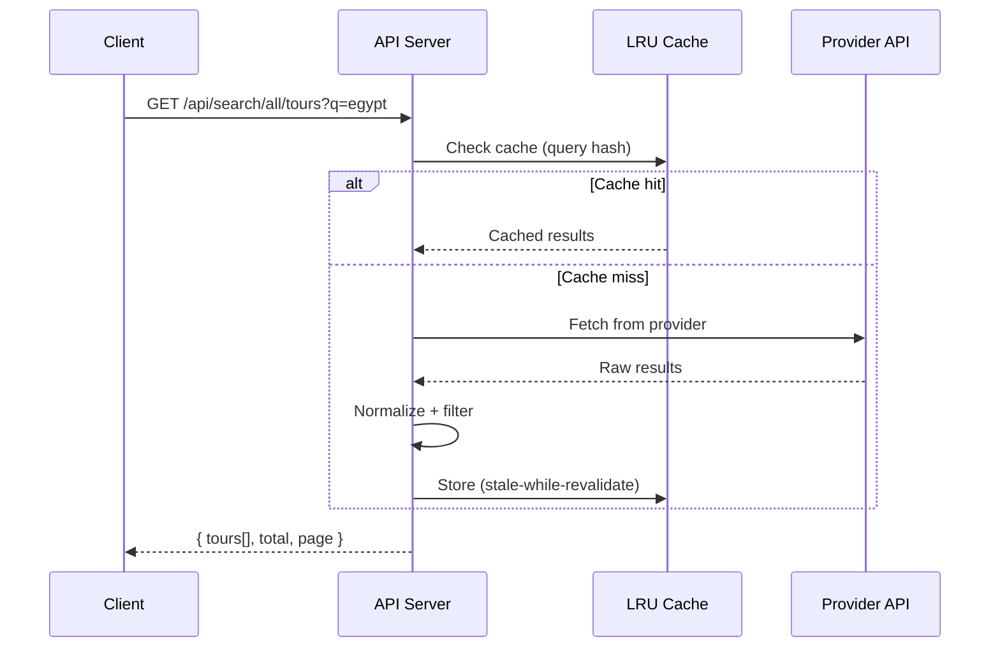

# Architecture

## System Overview



## Request Flow

1. User visits `sky-travel.tours`
2. Nginx serves client SPA (Vite preview / static build)
3. SPA makes `fetch()` calls to `/api/*`
4. Nginx proxies `/api/*` to Express server (port 4000)
5. Server queries MySQL (Prisma) or external provider APIs
6. Response returned to client → rendered in React

## Directory Structure

```
skytravel/
├── client/                    React 18 SPA
│   ├── src/
│   │   ├── api/               API fetch helpers
│   │   ├── components/        Shared UI components
│   │   ├── features/admin/    Admin-only feature modules
│   │   ├── hooks/             Custom React hooks
│   │   ├── lib/               Pure utility functions
│   │   ├── pages/             Route-level page components
│   │   ├── stores/            Zustand stores
│   │   └── types/             TypeScript type definitions
│   ├── public/                Static assets (robots.txt, sitemap.xml)
│   └── index.html             Entry HTML with OG tags + JSON-LD
├── server/
│   ├── src/
│   │   ├── lib/               Shared utilities (logger, ApiError, sessionStore)
│   │   ├── middleware/        Express middleware (auth, upload, timing)
│   │   ├── providers/         Provider abstraction layer
│   │   │   ├── types.ts       TourProvider interface contract
│   │   │   ├── registry.ts    Provider registration singleton
│   │   │   ├── alexandriaProvider.ts
│   │   │   └── orextravelProvider.ts
│   │   ├── routes/            API route handlers
│   │   │   ├── admin/         Admin-only endpoints
│   │   │   ├── health.ts      Liveness/readiness probes
│   │   │   ├── public.ts      Public tours + inquiries
│   │   │   └── providerSearchPublic.ts  Unified search
│   │   ├── app.ts             Express app factory
│   │   ├── config.ts          Env var parsing + validation
│   │   ├── index.ts           Server entry point
│   │   └── prisma.ts          Prisma client singleton
│   ├── prisma/
│   │   ├── schema.prisma      Database schema
│   │   └── migrations/        Migration history
│   └── __tests__/             Server test suite
├── e2e/                       Playwright E2E tests
├── scripts/
│   ├── deploy-remote.sh       Production deploy via SSH
│   └── backup-db.sh           MySQL daily backup
├── docs/                      Project documentation
├── ecosystem.config.cjs       PM2 process config
└── .github/
    └── workflows/
        ├── ci.yml             Lint → test → build pipeline
        ├── test.yml           Test-only workflow
        └── deploy.yml         Production deploy workflow
```

## Data Flow

### Public Search



### Admin Tour CRUD

```
Client → POST /api/admin/tours → requireAuth → validate (Zod) → Prisma → MySQL → 201
```

### Provider Sync

```
Cron/Manual → Provider API → Parse XML/JSON → Normalize → Upsert ProviderTour → Done
```

## Key Design Decisions

| Decision                      | Rationale                                                 |
| ----------------------------- | --------------------------------------------------------- |
| Session auth (not JWT)        | Simpler, revocable, no token refresh complexity           |
| Prisma (not raw SQL)          | Type safety, migrations, schema-as-docs                   |
| LRU cache (not Redis)         | Single server, simplicity, fits in 512M                   |
| Monorepo (not separate repos) | Shared tooling, atomic deploys, easier DX                 |
| Czech-first (not i18next)     | Single market, custom `useLanguage` hook is lighter       |
| pino (not winston)            | Faster, JSON-native, lower overhead                       |
| Zod (not joi)                 | TypeScript-first, tree-shakeable, smaller bundle          |
| ESM throughout                | Modern standard, better tree-shaking, native Node support |

## Caching Strategy

- **LRU cache** with 2000 entry limit
- **Single-flight** deduplication (concurrent identical requests share one fetch)
- **Stale-while-revalidate** — serve stale data immediately, refresh in background
- **Provider-specific refresh intervals** (configurable per provider)
- **Cache warming on startup** — pre-loads popular destinations

## Security Layers

1. **Helmet** — CSP, HSTS, X-Frame-Options, referrer policy
2. **CORS** — restricted to configured origins in production
3. **Rate limiting** — per-endpoint groups (auth: 10/15min, search: 200/min, admin: 300/min)
4. **Session auth** — httpOnly, secure, sameSite cookies backed by MySQL store
5. **Input validation** — Zod schemas on all route boundaries
6. **Upload restrictions** — mime type + size limits via multer
7. **XML hardening** — fast-xml-parser configured to prevent XXE
