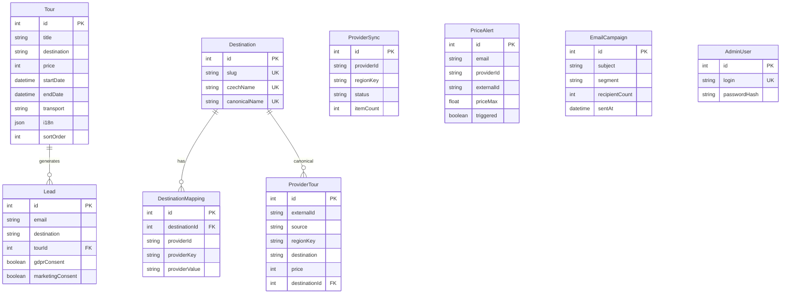

# Database Schema

MySQL 8.0, managed via Prisma 5.

## Entity Relationship Diagram



## Models

### Tour

Manually curated tours managed by admin.

- **i18n field:** `{ cs: { title, description }, en: { title, description } }`
- **source:** `"manual"` (admin-created) or `"import"` (bulk imported)
- **sortOrder:** controls display order on homepage
- **Indexes:** `source`, `source+externalId`, `sortOrder+createdAt`, `destination`

### ProviderTour

Tours fetched from external providers and cached in DB.

- **Unique constraint:** `source + externalId` (prevents duplicates per provider)
- **destinationId:** links to canonical Destination for unified search
- **syncedAt:** when this record was last refreshed from the provider
- **Key indexes:** `source+regionKey+price`, `source+regionKey+startDate+price`, `source+destination`, `source+stateId+price`

### Destination

Canonical destination registry for cross-provider mapping.

- **slug:** URL-friendly identifier (e.g. `"egypt"`)
- **czechName:** Czech display name (e.g. `"Egypt"`)
- **canonicalName:** Normalized name for matching

### DestinationMapping

Maps provider-specific destination identifiers to canonical Destinations.

- **Unique:** `providerId + providerKey + providerValue`
- Enables unified search across providers with different naming

### Lead

User inquiries / contact form submissions.

- **tourId:** optional FK to Tour (set when inquiry is about a specific tour)
- **gdprConsent / marketingConsent:** tracked separately for compliance
- **source:** identifies where the lead came from (e.g. `"tour-inquiry"`, `"lead-popup"`)

### PriceAlert

User subscriptions for price drop notifications.

- **Unique by:** email + providerId + externalId (one alert per tour per user)
- **triggered:** set to true when alert fires, prevents re-sending
- **priceMax:** user's target price threshold

### ProviderSync

Tracks sync status per provider per region.

- **status:** `"idle"` | `"syncing"` | `"error"`
- **itemCount:** number of tours in last successful sync
- Used by admin UI to show provider health

### EmailCampaign

Admin email campaigns sent to lead segments.

- **segment:** target audience (e.g. `"all"`, `"marketing-consent"`)
- **html:** full email HTML body (TipTap editor output)

### AdminUser

Admin panel credentials. Passwords hashed with bcryptjs (12 rounds).

## Migrations

- Location: `server/prisma/migrations/`
- Development: `npx prisma migrate dev --name description`
- Production: `npx prisma migrate deploy` (never `dev`)
- Naming convention: `YYYYMMDDHHMMSS_migration_NN_description`

## Common Operations

```bash
# Generate Prisma client after schema changes
npx --workspace server prisma generate

# Create a new migration
npx --workspace server prisma migrate dev --name add_new_field

# View database in browser
npx --workspace server prisma studio
```
